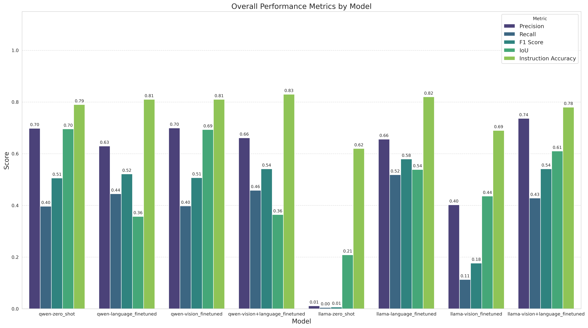

# SafetyVLM: Enhanced Vision-Language Models for Industrial Tool Safety

[](https://www.python.org/downloads/)
[](https://pytorch.org/)
[](https://huggingface.co/docs/transformers)
[](https://opensource.org/licenses/MIT)

## 🔧 Overview

Vision-Language Models (VLMs) excel at general visual understanding but struggle with specialized safety-critical domains like industrial tool recognition. This project addresses the gap in providing accurate, safety-focused guidance for industrial tool usage by fine-tuning state-of-the-art VLMs (Qwen2.5-VL and Llama-3.2-11B-Vision) with a custom dataset of 7,458 tool images enriched with safety annotations.

We enhance VLM performance through three key innovations:
- **LoRA fine-tuning** across vision-only, language-only, and vision+language strategies
- **RAG integration** to boost safety information accuracy from 72% to 90-92%
- **GRPO optimization** to maintain 80-85% of RAG's accuracy gains while eliminating inference latency

<div align="center">
  
  <p><em>System architecture showing the complete pipeline with LoRA fine-tuning, RAG enhancement, and GRPO optimization</em></p>
</div>

## ✨ Key Features

- **Industrial Tool Detection** - Accurate identification of 17 common mechanical tool categories with bounding boxes
- **Safety Information Generation** - Structured JSON output with PPE requirements, hazards, and common misuses
- **RAG Pipeline** - FAISS-based retrieval system for enhanced safety guidance accuracy
- **RLHF-GRPO Optimization** - Preference learning to internalize RAG behavior without runtime latency
- **Multi-Strategy Fine-tuning** - Vision-only, language-only, and combined approaches with LoRA
- **Comprehensive Evaluation** - Detection metrics (F1, IoU) plus LLM-based safety content assessment

## 📁 Dataset

Our custom Tool Safety Dataset is available on [🤗 Hugging Face](https://huggingface.co/datasets/akameswa/tool-safety-dataset) and contains:
- **7,458 images** of mechanical tools in various settings
- **16,567 annotations** across 17 tool categories
- **Enriched safety metadata** including PPE requirements, hazards, and common misuses
- **Structured JSON labels** for training VLMs to generate safety-aware outputs

Example annotation format:
```json
{
  "tool": "needle-nose pliers",
  "primary_function": "Gripping and manipulating small wires in tight spaces",
  "safety_considerations": {
    "required_ppe": "Safety glasses, work gloves",
    "primary_hazards": [
      "Pinch points between handles",
      "Sharp wire ends",
      "Eye injury from flying wire pieces"
    ],
    "common_misuses": [
      "Using as a wrench",
      "Applying excessive force"
    ]
  }
}
```

<div align="center">
  
  <p><em>Distribution of tool categories in the dataset</em></p>
</div>

## 🛠️ Technical Implementation

### Model Architecture

```python
# LoRA configuration for fine-tuning
from unsloth import FastVisionModel

model, tokenizer = FastVisionModel.from_pretrained(
    model_name="qwen/Qwen2.5-VL-7B",
    load_in_4bit=True,
    use_gradient_checkpointing="unsloth"
)

# Apply LoRA to specific layers
model = FastVisionModel.get_peft_model(
    model,
    finetune_vision_layers=True,  # For V and VL variants
    finetune_language_layers=True,  # For L and VL variants
    r=16,
    lora_alpha=16,
    lora_dropout=0,
    bias="none",
    use_rslora=False
)
```

### Pre-trained Models

All fine-tuned models are available on Hugging Face:
- 🤗 [Qwen2.5-VL-7B Fine-tuned (Vision+Language)](https://huggingface.co/akameswa/Qwen2.5-VL-7B-Instruct-bnb-4bit-finetune-vision-language)
- 🤗 [Llama-3.2-11B Fine-tuned (Vision+Language)](https://huggingface.co/akameswa/Llama-3.2-11B-Vision-Instruct-bnb-4bit-finetune-vision-language)
- 🤗 [Qwen2.5-VL-7B Fine-tuned (Vision-only)](https://huggingface.co/akameswa/Qwen2.5-VL-7B-Instruct-bnb-4bit-finetune-vision)
- 🤗 [Llama-3.2-11B Fine-tuned (Vision-only)](https://huggingface.co/akameswa/Llama-3.2-11B-Vision-Instruct-bnb-4bit-finetune-vision)
- 🤗 [Qwen2.5-VL-7B Fine-tuned (Language-only)](https://huggingface.co/akameswa/Qwen2.5-VL-7B-Instruct-bnb-4bit-finetune-language)
- 🤗 [Llama-3.2-11B Fine-tuned (Language-only)](https://huggingface.co/akameswa/Llama-3.2-11B-Vision-Instruct-bnb-4bit-finetune-language)

### RAG Integration

```python
# RAG pipeline for safety information retrieval
from sentence_transformers import SentenceTransformer
import faiss

# Create embeddings for knowledge base
def create_embeddings(knowledge_df):
    model = SentenceTransformer('all-MiniLM-L6-v2')
    
    texts = []
    for _, row in knowledge_df.iterrows():
        text = f"Tool: {row['tool_name']}. "
        text += f"Function: {row['primary_function']}. "
        text += f"Safety: {row['safety_considerations']}"
        texts.append(text)
    
    embeddings = model.encode(texts, batch_size=8)
    return embeddings, model

# Build FAISS index for fast retrieval
embeddings = embeddings.astype(np.float32)
faiss.normalize_L2(embeddings)
index = faiss.IndexFlatIP(dimension)
index.add(embeddings)
```

### GRPO Training

```python
# GRPO implementation for preference learning
from trl import GRPOTrainer, GRPOConfig

# Generate preference pairs
paired_data = []
for image in dataset:
    standard_response = generate_standard_response(image)
    rag_response = generate_rag_response(image)
    
    paired_data.append({
        'image': image,
        'chosen': rag_response,    # RAG-enhanced response
        'rejected': standard_response  # Standard response
    })

# Train with GRPO
trainer = GRPOTrainer(
    model=model,
    args=training_args,
    train_dataset=paired_data,
    beta=0.1,  # Controls preference strength
)
```

## 📊 Results

### Performance Comparison

| Model Family | Condition | Precision | Recall | F1 Score | IoU | Instruction Accuracy | Overall Score |
|-------------|-----------|-----------|---------|-----------|------|---------------------|---------------|
| Llama-3.2-11B | Zero-shot (Z) | 0.0114 | 0.0047 | 0.0066 | 0.2087 | 0.62 | 6.18 |
| Llama-3.2-11B | Fine-tuned (V+L) | **0.7365** | 0.4281 | 0.5415 | **0.6102** | 0.78 | 7.83 |
| Llama-3.2-11B | Fine-tuned (L) | 0.6562 | **0.5186** | **0.5794** | 0.5388 | **0.82** | **8.36** |
| Llama-3.2-11B | Fine-tuned (V) | 0.4022 | 0.1131 | 0.1766 | 0.4358 | 0.69 | 5.93 |
| Qwen2.5-VL | Zero-shot (Z) | 0.6981 | 0.3967 | 0.5059 | **0.6958** | 0.79 | 8.07 |
| Qwen2.5-VL | Fine-tuned (V+L) | 0.6613 | **0.4583** | **0.5414** | 0.3643 | **0.83** | **8.28** |
| Qwen2.5-VL | Fine-tuned (L) | 0.6296 | 0.4450 | 0.5214 | 0.3574 | 0.81 | 7.90 |
| Qwen2.5-VL | Fine-tuned (V) | **0.6995** | 0.3978 | 0.5072 | 0.6931 | 0.81 | 8.07 |

*Best results per model family shown in bold.*

### Key Performance Insights

- **Detection Accuracy**: F1 score improved from 0.006 (Llama zero-shot) to 0.58 (fine-tuned)
- **Safety Information**: Accuracy increased from 83% to 90-92% with RAG
- **GRPO Efficiency**: Achieved ~82% of RAG's gains with 30% lower inference latency
- **Best Configuration**: Qwen2.5-VL with V+L fine-tuning for overall performance

### Key Visualizations

<div align="center">
  
  <p><em>Overall performance metrics across model variants</em></p>
</div>

<div align="center">
  
  <p><em>Comparison of fine-tuning strategies</em></p>
</div>

<div align="center">
  
  <p><em>Detailed performance analysis across evaluation metrics</em></p>
</div>

## 🚀 Quick Start

### 1. Environment Setup

```bash
git clone https://github.com/yourusername/VLM-Tool-Recognition.git
cd VLM-Tool-Recognition

# Create conda environment
conda env create -f environment.yml
conda activate vlm-tools
```

### 2. Run Fine-tuned Model Inference

```python
from unsloth import FastVisionModel
from PIL import Image

# Load fine-tuned model
model, tokenizer = FastVisionModel.from_pretrained(
    "akameswa/Qwen2.5-VL-7B-Instruct-bnb-4bit-finetune-vision-language",
    load_in_4bit=True
)

# Run inference
image = Image.open("tool_image.jpg")
messages = [{
    "role": "user",
    "content": [
        {"type": "image"},
        {"type": "text", "text": "Identify tools and provide safety information"}
    ]
}]

inputs = tokenizer.apply_chat_template(messages, tokenize=True, add_generation_prompt=True, return_tensors="pt")
outputs = model.generate(**inputs, max_new_tokens=500)
print(tokenizer.decode(outputs[0]))
```

### 3. RAG-Enhanced Inference

```bash
cd rag-imp
python run_single_rag.py --image_path test_images/sample_image_0.jpg --model_path path/to/model
```

### 4. GRPO Training

```bash
cd grpo
python run_grpo_workflow.py --model_path path/to/model --num_samples 50 --beta 0.1
```

## 🏗️ Project Structure

```
VLM-Tool-Recognition/
├── dataset/            # Dataset processing and ground truth generation
├── training/           # LoRA fine-tuning scripts
├── evals/              # Evaluation pipelines and visualization
│   ├── vlm-evaluation/ # Detection metrics evaluation
│   └── vlm_llm_eval/   # LLM-based safety content evaluation
├── rag-imp/            # RAG implementation and testing
├── grpo/               # GRPO training and optimization
└── assets/             # Images and documentation
```

## 🔬 Evaluation Methodology

Our evaluation framework combines traditional computer vision metrics with LLM-based semantic assessment:

1. **Detection Metrics**: Precision, Recall, F1, IoU for tool identification
2. **Safety Content Assessment**: Using Gemini-2.5-Pro to score:
   - Tool identification accuracy
   - Primary function correctness
   - Safety information completeness
   - Common misuse coverage

## 👥 Authors

- akameswa
- sselvam

## 📝 License

MIT License